# Deploy-Static-Website-on-AWS
This guides you to hosting a Static Website on AWS and distributing it using CloudFront.

## Pre-requesites
 * AWS Account.
 * A Starter code base (Clone ["Starter Code"](https://github.com/eledor-dev/Static-Web-Starter-Code) here)

## STEP 1

<br>

 *  Create an S3 bucket

    1. Navigate to the AWS Console Management and search "S3" in the service find box and select "S3"

    <br>

    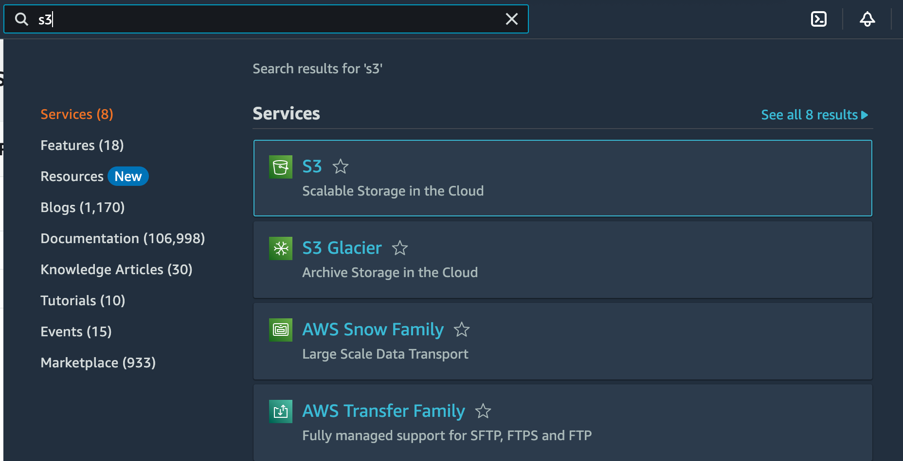

    <br>

    2.  On the S3 Dashboard, Select "create bucket"
    
    <br>

    

    <br>

    3. In the General configuration, enter a “Bucket name” and a region of your choice. Note: Bucket names must be globally  unique.
    
    <br>

    

    <br>
    
    4. In the Bucket settings for Block Public Access section, uncheck the “Block all public access”. It will enable the public access to the bucket objects via the S3 object URL.

       <br>

          Note - We are allowing the public access to the bucket contents because we are going to host a static website in this bucket. Hosting requires the content should be publicly readable.
    
    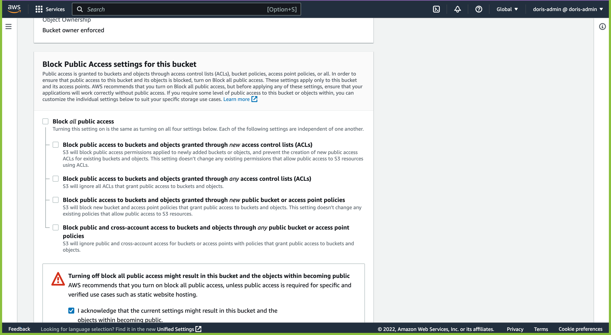

    5. Click “Create bucket”.
    
    6. Once the bucket is created, click on the name of the bucket to open the bucket to the contents.

   <br>

## STEP 2

<br>

 * Upload files to the S3 bucket

    1. Once the bucket is open to its contents, click the “Upload” button.
        
    2. Click the "Add files" and “Add folder” button, and upload the ["Starter Code"](https://github.com/eledor-dev/Static-Web-Starter-Code) folder content from your local computer to the S3 bucket.

    <br>
    
    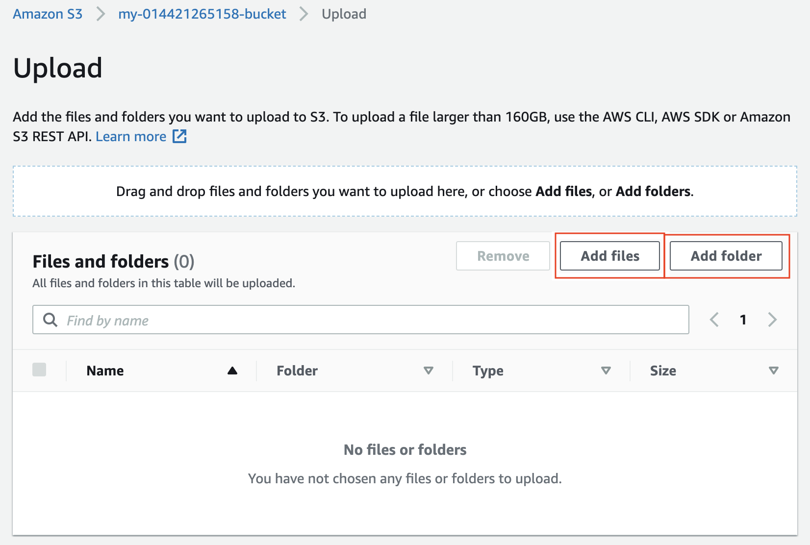

    <br>

        Click "Add files" to upload the index.html file, and click "Add folder" to upload the css, img, and vendor folders.
    <br>

## STEP 3

<br>

 * Secure the bucket via IAM

    1. Click on the “Permissions” tab.

    <br>

    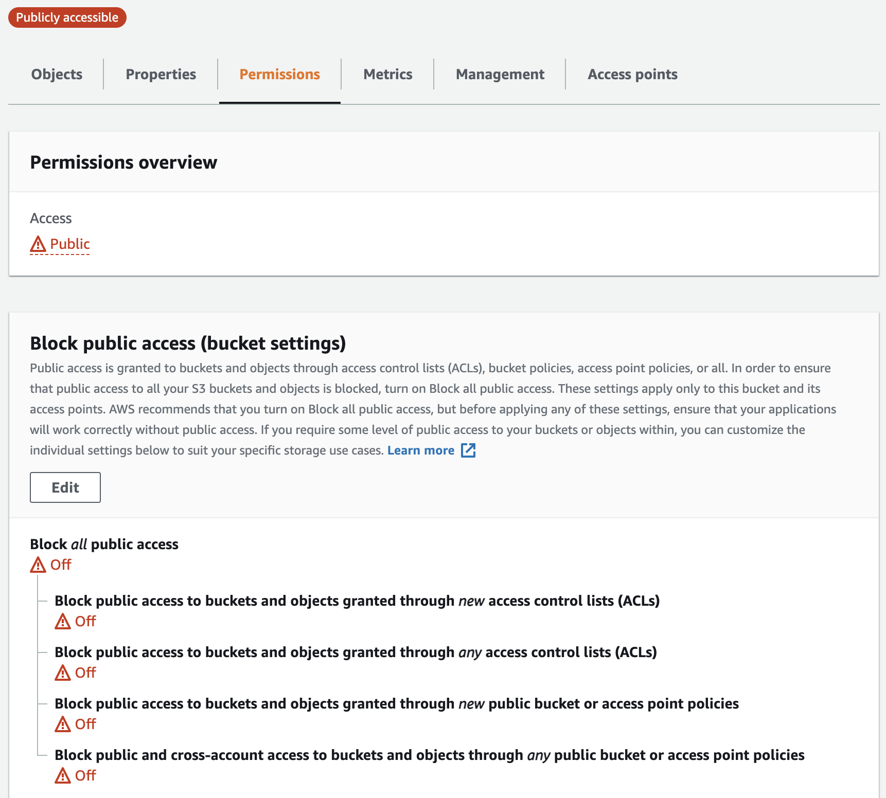

    <br>
            Go to the Permissions tab. See that the bucket allows public access for hosting.

    <br>

    2. The “Bucket Policy” section shows it is empty. Click on the Edit button.

     <br>

    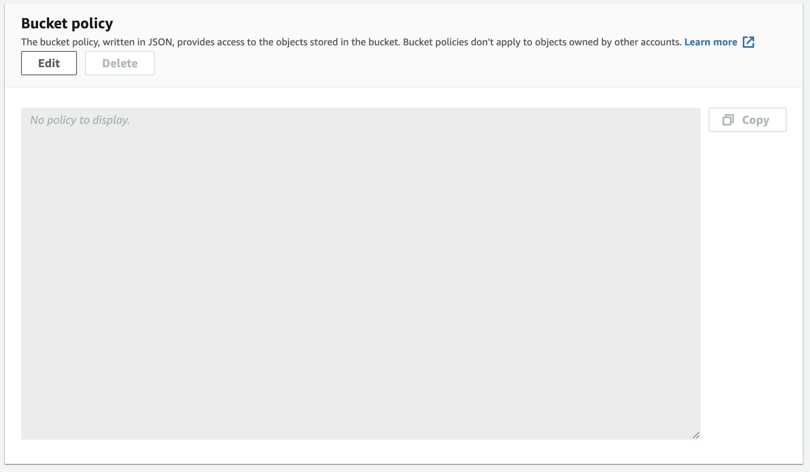

    <br>
    3. Enter the following bucket policy replacing your-website with the name of your bucket and click “Save”.

    ```
        {
        "Version":"2012-10-17",
        "Statement":[
        {
        "Sid":"AddPerm",
        "Effect":"Allow",
        "Principal": "*",
        "Action":["s3:GetObject"],
        "Resource":["arn:aws:s3:::your-website/*"]
         }
        ]
        }
    ```
            You will see warnings about making your bucket public, but this step is required for static website hosting.
    
## STEP 4
 * Configure the S3 bucket 

    1. Go to the Properties tab and then scroll down to edit the Static website hosting section.

    <br>

    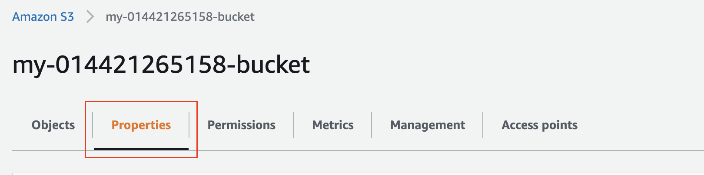

    <br>

    <br>

    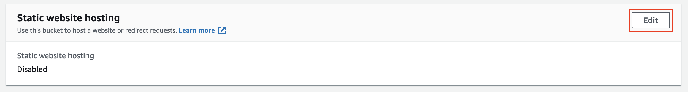

    <br>

    2. Click on the “Edit” button to see the Edit static website hosting screen. Now, enable the Static website hosting, and provide the default home page and error page for your website.

     <br>

    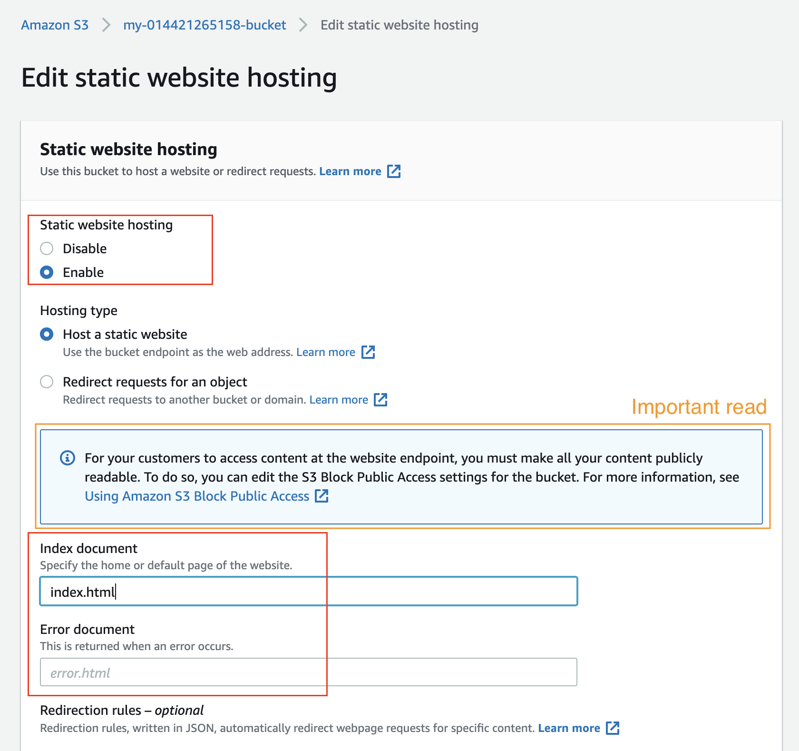

    <br>

    3. For both “Index document” and “Error document”, enter “index.html” and click “Save”. After successfully saving the settings, check the Static website hosting section again under the Properties tab. You must now be able to view the website endpoint as shown below:

    <br>

    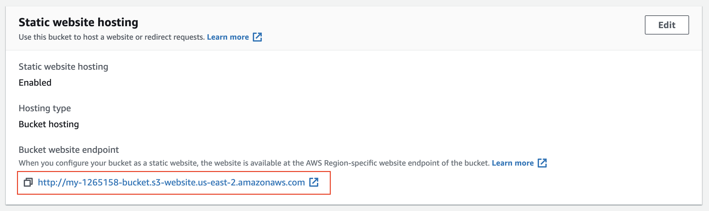

    <br>
 
## STEP 5
 * Distribute Website via CloudFront

   1. Select “Services” from the top left corner and enter “cloud front” in the “Find a service by name or feature” text box and select “CloudFront”.

    <br>

    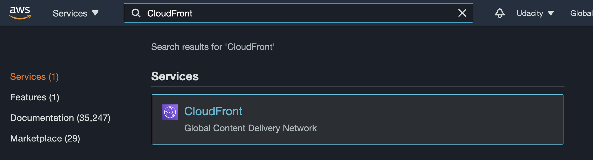

    <br>

    2. From the CloudFront dashboard, click “Create Distribution”.


    <br>

    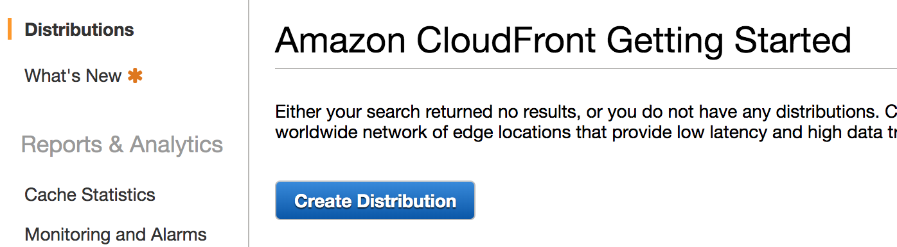

    <br>

    3. For “Select a delivery method for your content”, click “Get Started”.

    <br>

    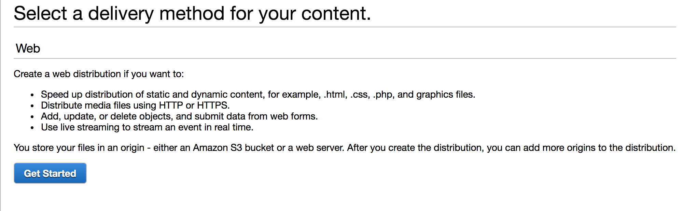

    <br>

    4. Use the following details to create a distribution:

    <br>

    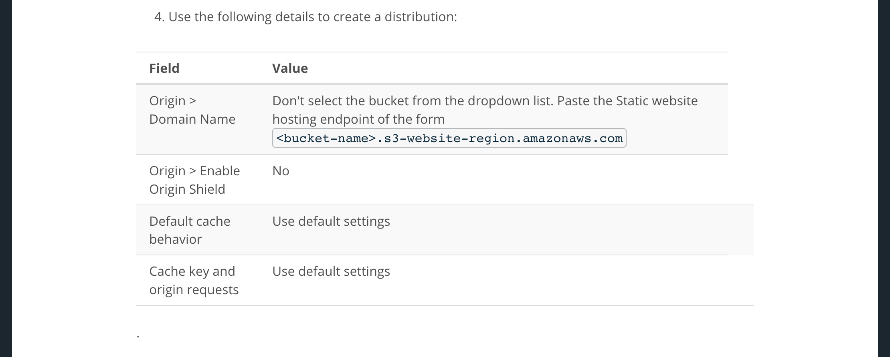


    <br>

    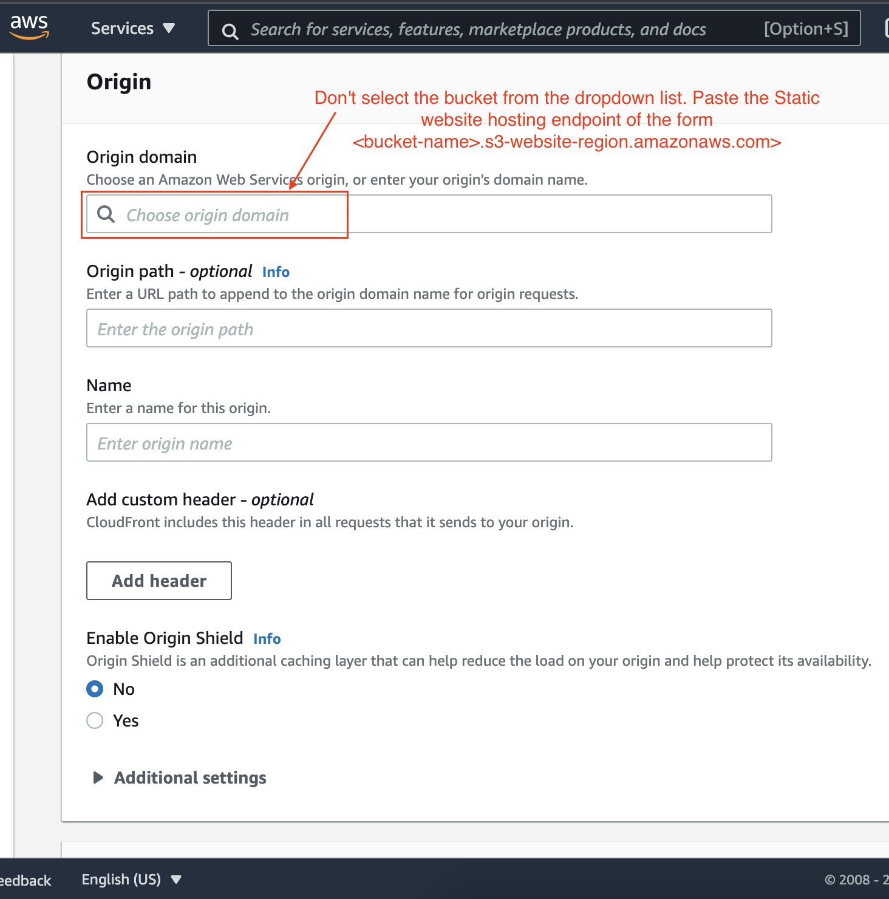

    <br>

    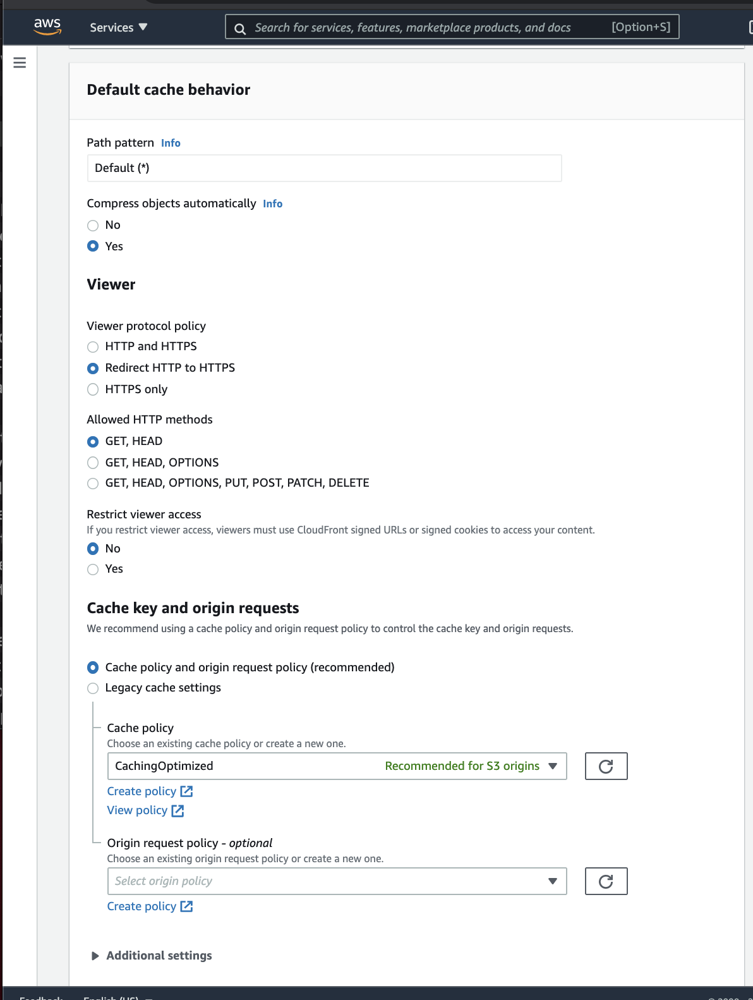

    5. Leave the defaults for the rest of the options, and click “Create Distribution”. It may take up to 10 minutes for the CloudFront Distribution to get created.


    6. Once the status of your distribution changes from “In Progress” to “Deployed”, copy the endpoint URL for your CloudFront distribution found in the “Domain Name” column.
  <br>

    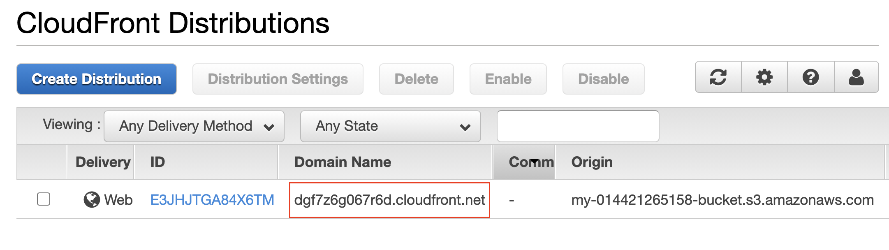

  <br>

NOTE:

## STEP 6
 * Access the Website in your Web Browser 

 1. Open a web browser like Google Chrome, and paste the copied CloudFront domain name (such as, dgf7z6g067r6d.cloudfront.net) without appending /index.html at the end. The CloudFront domain name should show you the content of the default home-page, as shown below:

  <br>

  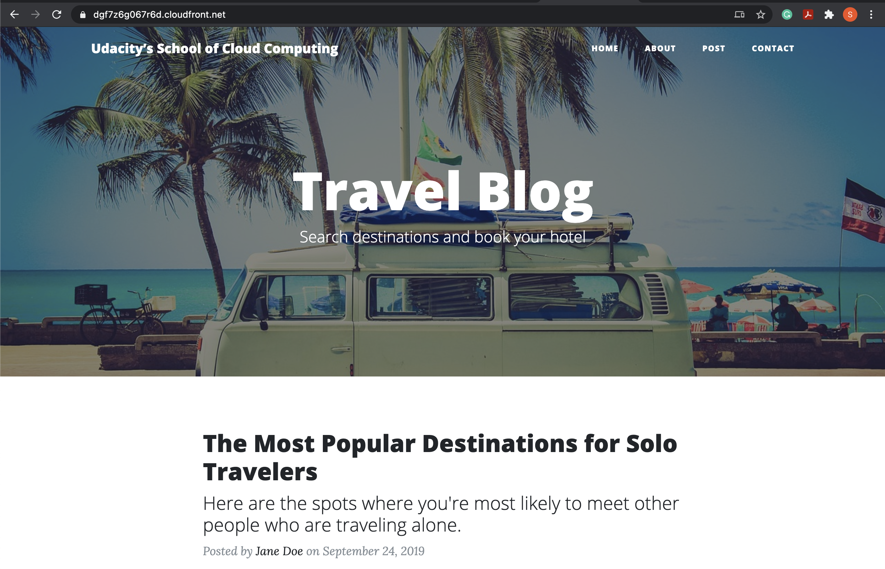

  <br>
    
 2. Access the website via website-endpoint, such as http://<bucket-name>.s3-website.us-east-2.amazonaws.com/.

 3. Access the bucket object via its S3 object URL, such as, https://<bucket-name>.s3.amazonaws.com/index.html.
 
 All three links: CloudFront domain name, S3 object URL, and website-endpoint will show you the same index.html content.

 NOTE:
 If we were not "hosting" the website on S3, we could have made the bucket private and host the content only through the CloudFront domain name. In such a case, we cannot access the private content using S3 object URL and website-endpoint.


 Troubleshooting Tip
 1. After completing the project instructions, if you are unable to view the website contents, refer to the following guide: I’m using an S3 website endpoint as the origin of my CloudFront distribution. Why am I getting 403 Access Denied errors?

 2. Refer to this official tutorial Using a website endpoint as the origin, with anonymous (public) access allowed, and verify if you have used the correct domain for your distribution. It should essentially be the Static website hosting endpoint of the form <bucket-name>.s3-website-region.amazonaws.com.

  

  <br>

   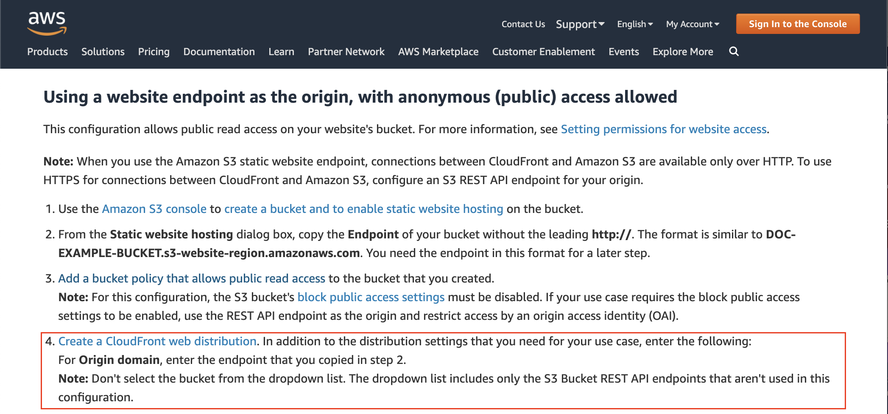

  <br>
